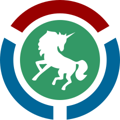

# WMCS Uptime
  

    

A **moderately modified** version of [louislam](https://github.com/louislam)'s awesome project, **[uptime-kuma](https://github.com/louislam/uptime-kuma)** for use on WMCS — you probably don't want this, so please check out the [original](https://github.com/louislam/uptime-kuma)!

## A note on open source
I wouldn't be able to hack away at this project if it weren't licensed under the [MIT license](https://opensource.org/licenses/MIT) — although I'm free to (thank you louislam!), I believe in "putting my money where my mouth is" and so have [sponsored him](https://github.com/sponsors/louislam).

If you can, I'd really encourage you to sponsor great open source projects (and more importantly, their developers!).